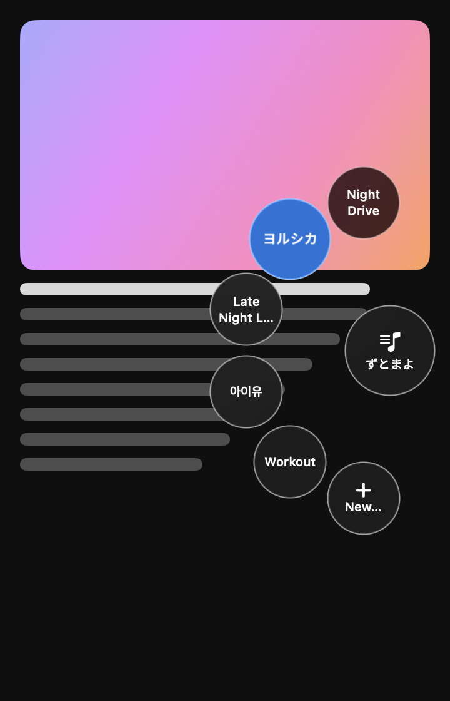
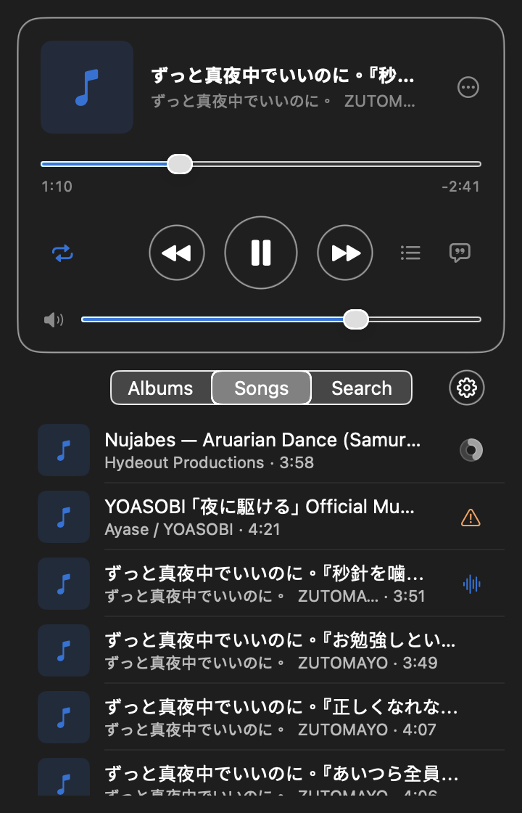
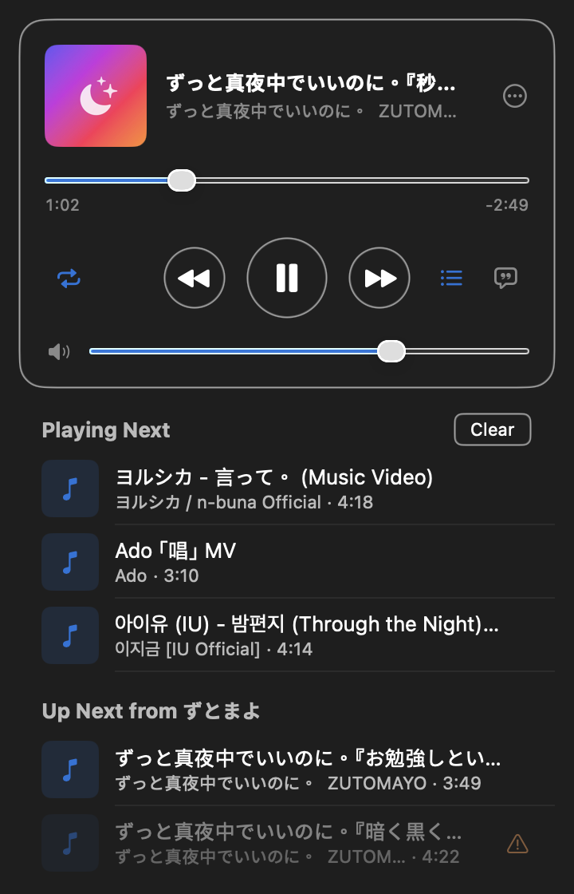
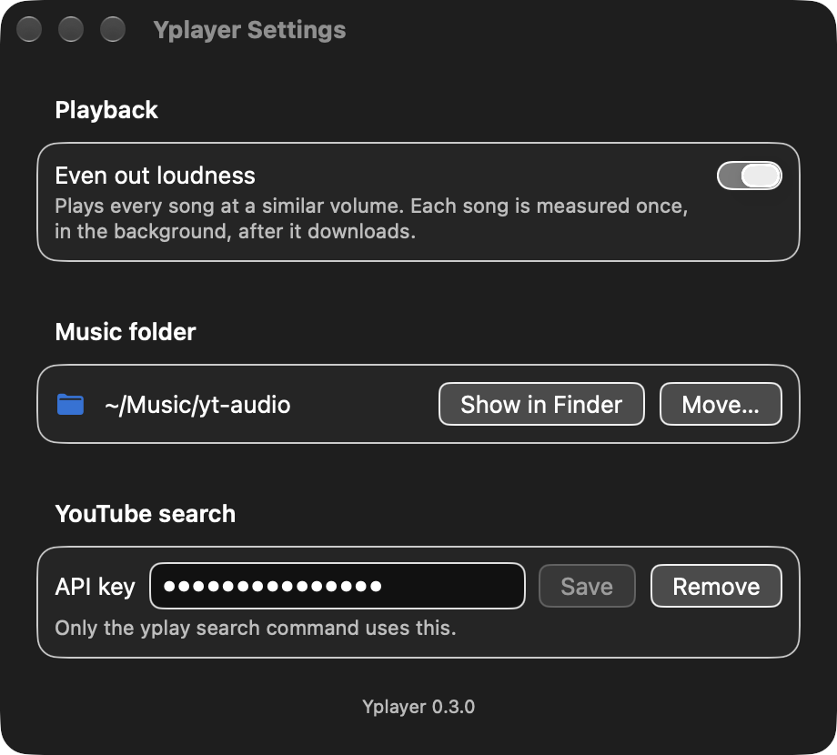

# Yplayer

[English](README.md) | **繁體中文**

一款 macOS 上的 YouTube 音樂播放器，從本機快取播放。把 Safari 或 Chrome 裡的 YouTube 連結拖到浮動的圓球上：歌曲會加進專輯，幾秒內開始播放，之後每次播放都不需要網路。選單列 App 用來瀏覽音樂庫與控制播放；`yplay` 指令則可以在終端機控制同一個背景服務。

<p align="center">
  
  
  
</p>

## 安裝

把這行貼到終端機：

```bash
/bin/bash -c "$(curl -fsSL https://raw.githubusercontent.com/HaoWen46/yplayer/main/scripts/get.sh)"
```

需要 macOS 26 以上、Apple 晶片的 Mac，以及 [Homebrew](https://brew.sh)。安裝程式會：

- 用 Homebrew 安裝缺少的 `mpv`、`ffmpeg`、`deno` 和 `uv`（第一次可能要花幾分鐘）；
- 下載最新的[發行版本](https://github.com/HaoWen46/yplayer/releases)並核對檢查碼；
- 把 `Yplayer.app` 放到 `~/Applications`、`yplay` 指令放到 `~/.local/bin`，下載器用的 Python 環境放在 `~/Library/Application Support/yplayer/venv`；
- 啟動播放服務和選單列 App，並設定兩者在登入時自動啟動。

歌曲存放在 `~/Music/yt-audio`（可在設定裡更改）。不需要帳號，也不需要授予任何權限。

**更新：** 再執行一次同一行指令。**解除安裝：** `"$HOME/Library/Application Support/yplayer/uninstall.sh"`（會保留你的歌曲和設定）。

## 使用方式

- **加入歌曲：** 開始拖曳一個 YouTube 連結（Safari 網址列裡的網址、Chrome 網址左邊的網站圖示，或網頁上的任何連結）。螢幕右側邊緣會出現一顆圓球；把連結放到圓球上，或放到它展開的某個專輯上。歌曲會邊下載邊在幾秒內開始播放，之後不會再下載第二次。6 秒內都可以按「Undo」復原。
- **播放與瀏覽：** 按選單列的 ♪。空白鍵播放／暫停，⌘F 搜尋，鍵盤的媒體鍵和控制中心也能用。
- **接下來播放（Up Next）：** 歌詞按鈕旁邊的清單按鈕會顯示接下來要播的歌；拖曳可調整順序，滑動可移除，按兩下可直接跳過去播。
- **設定：** 齒輪按鈕（或 ⌘,）：平衡響度、搬移音樂資料夾、YouTube 搜尋金鑰。
- **終端機：** `yplay add <網址>`、`yplay now`、`yplay toggle`、`yplay --help`。

<p align="center">
  
</p>

## 效能

在 MacBook Air（Apple 晶片、macOS 27）上用 `top` 以 20 秒為一段量測（[量測方法](#效能檢查)）。

| | 記憶體 | 閒置時的 CPU |
|---|---|---|
| 背景服務，沒有播放 | 3–4 MB | 每秒 0 次喚醒：沒有計時器、沒有輪詢 |
| 選單列 App，彈出視窗關閉 | 剛啟動 19 MB，用過後約 43 MB | 每秒 0 次喚醒 |
| 播放器（mpv）播放中 | 約 46 MB，約 3 % CPU | — |
| 不需要時的播放器和下載器 | 不執行：停止播放 10 分鐘後 mpv 會結束，下載器在最後一次下載 60 秒後結束 | — |

| 速度 | |
|---|---|
| 新連結 → 開始出聲 | 約 3.7 秒（邊下載邊播放） |
| 已存的歌曲 → 開始播放 | 0.009 秒，不用網路 |
| 搜尋，20,000 首歌 | 第一個字 6 毫秒，之後每個字 2.4 毫秒 |
| 歌曲清單更新，20,000 首歌 | 17 毫秒 |
| 響度量測 | 每首約 0.5 秒，只做一次，在背景進行 |

網路用量，以一首 4.5 分鐘的歌為例（[秒針を噛む](https://www.youtube.com/watch?v=GJI4Gv7NbmE)）：

| | 資料量 |
|---|---|
| Yplayer | 只下載一次 4.0 MB（只有音訊，保留 YouTube 原本的 Opus 格式），之後完全不用 |
| YouTube 480p | 每次播放 9–14 MB |
| YouTube 720p | 每次播放 14–23 MB |
| YouTube 1080p | 每次播放 26–43 MB |

其他流量：每首歌的封面和歌詞各下載一次，以及每天一次的 yt-dlp 版本檢查。

## 選單列 App

`Yplayer.app` 只出現在選單列（Dock 裡沒有圖示）。它是服務的用戶端：需要 `yplay serve` 正在執行（也就是 LaunchAgent `com.yplayer.service`），自己不會播放聲音。連不上服務時會顯示「Can't reach the yplay service — retrying in Ns」和「Retry Now」按鈕。

- 選單列圖示：沒在播放時是 `music.note`，播放中是 `waveform`；按一下開啟或關閉彈出視窗。
- 正在播放卡片：封面、標題、上傳者、可拖曳的進度條（已播放／剩餘時間）、上一首 · 播放／暫停 · 下一首、循環模式（不循環 → 全部 → 單曲 → 隨機）、音量、接下來播放與歌詞切換（開啟時會取代音樂庫的位置），以及 ⋯ 選單（Remove from Album…、Delete from Library…、Show in Finder、Copy YouTube Link）。
- 音樂庫分頁：Albums · Songs · Search。Albums：按 + 建立專輯，按兩下名稱可重新命名，「Delete Album…」只刪專輯、保留歌曲。專輯裡的歌可拖曳調整順序。下載中的歌會顯示進度；下載失敗的會顯示警告圖示，並有「Retry」選項。
- 歌曲列：按兩下或按 Return 播放；按右鍵有 Play Next、Add to Album ▸、Remove from Album…（專輯內）、Delete from Library…、Show in Finder、Copy YouTube Link、Retry（僅失敗的歌）、Rename…；觸控式軌跡板向左滑可從專輯移除（專輯內）或從音樂庫刪除（Songs）。
- 從音樂庫刪除會把音訊檔移到垃圾桶；每次移除或刪除都會先請你確認。
- 接下來播放（Up Next）：「Playing Next」（用 Play Next 加入的歌；可清除、可拖曳調整順序）和「Up Next from <專輯>」（專輯或音樂庫接著會播的歌）。按兩下或按 Return 立刻播放該首；向左滑、⌫ 或右鍵選單只會把它從接下來播放移除。
- 設定（音樂庫分頁上的齒輪按鈕，或 ⌘,）：平衡響度（Even out loudness）、音樂資料夾（Show in Finder；Move… 可搬到同一顆磁碟上的其他資料夾），以及 `yplay search` 用的 YouTube API 金鑰。設定視窗開著時，Dock 會暫時出現 App 圖示。
- 鍵盤的媒體鍵和控制中心的「正在播放」會顯示目前的歌曲，也能控制播放。

鍵盤快速鍵（彈出視窗開啟時）：

| 按鍵 | 動作 |
|-----|--------|
| 空白鍵 | 播放／暫停（在文字欄位輸入時除外） |
| ⌘F | 搜尋音樂庫 |
| ⌘, | 開啟設定 |
| Return | 播放選取的歌 |
| ⌫ | 從專輯移除（專輯內）或從音樂庫刪除（Songs），會先確認 |
| ⌘⌫ | 從音樂庫刪除，會先確認 |
| Esc | 關閉確認視窗；沒有確認視窗時關閉彈出視窗 |

安裝與解除安裝：`scripts/install.sh` 也會用 `scripts/build-app.sh` 建置 App、安裝到 `~/Applications/Yplayer.app`（取代舊版）、寫入 `~/Library/LaunchAgents/com.yplayer.app.plist`（`RunAtLoad`；只有異常結束時才會重新啟動；只在圖形介面登入時執行；記錄寫到 `~/Library/Logs/yplayer/app.log`），並用 `launchctl bootstrap gui/$UID` 重新啟動它。`scripts/uninstall.sh` 也會停止 App，並移除它的 LaunchAgent plist 和 `~/Applications/Yplayer.app`。`just app` 只會建置 `build/Yplayer.app`。

## 拖放圓球

開始拖曳 YouTube 連結時，游標所在螢幕的右側邊緣會出現一顆玻璃圓球；拖曳結束後它會再隱藏。不需要任何權限。

- 拖到圓球上它就會展開：中間是你上次用的專輯（沒有專輯時是 Inbox），周圍是最多 5 個最近用過的專輯和 **+ New…**。
- 放到某個專輯上，歌曲就會加進那個專輯並立刻開始播放，即使還在下載中。
- 放到 **+ New…** 上可以輸入新專輯的名稱（Return 建立，Esc 取消）。
- 圓球旁會出現 6 秒的 **Undo** 提示：按下後會把歌從專輯拿掉；如果是新下載的歌，也會把它移到垃圾桶。
- 如果連結不是單一個 YouTube 影片（例如播放清單或其他網站），圓球會搖一搖並顯示簡短說明，不會加入任何東西。
- 可以拖曳的來源：Safari 的網址列和網頁上的連結；Chrome 網址左邊的網站圖示和網頁上的連結。Chrome 的分頁無法拖出 Chrome，所以不支援。

## 指令列用法

`yplay --help`：

```
Fast YouTube audio player with local cache

Usage: yplay [OPTIONS] [COMMAND]

Commands:
  serve    Run the background service
  add      Add a YouTube URL to an album and play it
  play     Play a track from the library or an album
  pause    Pause playback
  resume   Resume playback
  toggle   Toggle pause
  stop     Stop playback
  next     Next track
  prev     Previous track
  now      Show the current track
  albums   List albums
  search   Search YouTube
  formats  List audio formats for a URL
  help     Print this message or the help of the given subcommand(s)

Options:
      --socket <SOCKET>  Service socket (default: $YPLAY_SOCKET, else <state dir>/yplay.sock)
  -h, --help             Print help
```

子指令選項（`yplay <指令> --help`）：

| 指令 | 選項 |
|---------|---------|
| `serve` | `--dir <DIR>` 快取資料夾（預設：設定檔裡的值，否則 `~/Music/yt-audio`） |
| `add <URL>` | `--album <ALBUM>`（預設：上次用的專輯，否則 Inbox）；`--no-play`；`--wait` 等下載完成並顯示花費時間 |
| `play <TRACK_ID>` | `--album <ALBUM>` 從哪個專輯播放（預設：整個音樂庫） |
| `search <QUERY>` | `--limit <LIMIT>` 最多幾筆結果（預設 10） |
| `formats <URL>` | — |

`search` 和 `formats` 直接呼叫下載器，不需要服務在執行；除了 `serve` 之外的其他指令都是和正在執行的服務溝通。

```bash
yplay add "https://www.youtube.com/watch?v=jNQXAC9IVRw" --wait
# Added Me at the zoo → Inbox
# first audio after <x.x>s
# downloaded in <y.y>s
yplay now          # ▶ 標題 — 上傳者  m:ss / m:ss  [專輯]（⏸ 暫停，■ 停止）
yplay albums       # 名稱  (n songs)
yplay toggle
```

只接受單一個 YouTube 影片；播放清單網址會被拒絕。加入已經下載過的網址會立刻播放（搭配 `--wait` 時顯示 `cached — playing`）。

結束代碼：`0` 成功；`1` 服務回傳錯誤（會印出錯誤訊息）；`2` 服務沒有在執行（`yplay service is not running — start it with: yplay serve`）。

## 設定檔

`~/Library/Application Support/yplayer/config.toml`（每個鍵都可省略）：

| 鍵 | 意義 |
|-----|---------|
| `cache_dir` | 快取資料夾（預設 `~/Music/yt-audio`） |
| `volume` | 初始音量，0.0–1.0（以上次工作階段的音量為準） |
| `api_key` | `yplay search` 用的 YouTube Data API 金鑰（否則讀 `YT_API_KEY`） |
| `worker_python` | 下載器用的 Python 的絕對路徑（由安裝程式寫入） |
| `level_loudness` | 讓每首歌的響度接近（預設 `true`；App 的設定視窗會寫入這個值） |

環境變數：

| 變數 | 作用 |
|----------|--------|
| `YPLAY_SOCKET` | 服務的 socket 路徑（`--socket` 優先） |
| `YPLAY_MPV_EXTRA_ARGS` | 額外的 mpv 參數，以空白分隔，由服務附加上去（例如 `--ao=null`） |
| `YPLAY_NO_UPDATE` | 設定後，服務會跳過 yt-dlp 的更新檢查 |
| `YPLAY_WORKER_CMD` | 下載器指令，以空白分隔，取代 `<worker_python> -m yplayer.worker`（測試時用假的下載器） |

檔案：

| 路徑 | 內容 |
|------|----------|
| `~/Library/Application Support/yplayer/` | `config.toml`、`yplay.sock`、`yplay.mpv.sock`、`worker.log`、yt-dlp 更新時間戳記（資料夾權限 0700，socket 0600） |
| `~/Library/Logs/yplayer/service.log` | launchd 下服務的標準輸出／錯誤 |
| `~/Library/Logs/yplayer/app.log` | launchd 下選單列 App 的標準輸出／錯誤 |
| `~/Music/yt-audio/` | 快取和音樂庫資料庫（見下方） |

## 響度平衡

開啟 `level_loudness` 時，服務會用 ffmpeg 的 EBU R128 濾鏡把每首歌量測一次（整合響度和取樣峰值；以背景優先權、一次一首進行：先量新下載的歌，再量正在播放的歌，最後是音樂庫其餘的歌），然後用 mpv 的 `volume-gain` 播放，把它調到 −14 LUFS，同時不讓峰值超過 −1 dBFS，增益限制在 −20…+10 dB 之間；還沒量測的歌會用所有已量測歌曲的增益中位數。響度平衡需要服務的 `PATH` 裡有 `ffmpeg`（`brew install ffmpeg`）；沒有的話就不會量測，每首歌都以原本的音量播放。

## 快取結構

```
~/Music/yt-audio/
  <標題> [<id8>]/           # 每首歌一個資料夾
    audio.<ext>             # 原始格式的最佳音訊串流
    cover.jpg               # 封面（YouTube 沒有時就不存在）
    meta.json               # 中繼資料，最後才寫入（代表下載完成）
  .yplayer.db               # SQLite 音樂庫：歌曲、專輯、歌詞
  .yplayer_state.json       # 工作階段狀態（音量、上次播放的歌）
```

舊版的平面檔案（`<id>.<ext>` + `<id>.json`）仍然可以辨識，舊版的 `albums/*.album.json` 會一次匯入資料庫。

## 架構

```
 Yplayer.app（選單列 + 圓球）───┐
 yplay 指令 (add/play/pause/…) ─┤ Unix socket，一行一個 JSON
                                │ ~/Library/Application Support/yplayer/yplay.sock
                                ▼
                        yplay serve（Rust，LaunchAgent，KeepAlive）
                        ├─ 音樂庫：SQLite，唯一的寫入者
                        ├─ 播放器：一個常駐的 mpv（--idle=yes），事件驅動的 IPC
                        ├─ 下載器：需要時才啟動的 Python yt-dlp worker，可同時下載
                        └─ 歌詞：透過 HTTP 取自 LRCLIB，快取在 SQLite
```

- 服務是唯一的資料來源：用戶端從不直接碰資料庫、mpv 或快取檔案。
- mpv 在第一次播放時啟動，停止 10 分鐘後結束；Python 下載器在第一次下載時啟動，最後一個工作結束 60 秒後結束。
- 每天最多檢查一次 yt-dlp 更新，有新版本時用 `uv` 升級。

## 從原始碼建置

用於開發，或在 Intel Mac 上使用。需求：

| 工具 | 必要 | 用途 |
|------|----------|---------|
| **macOS 26** | 是 | 選單列 App 的 Liquid Glass 介面 |
| **Xcode Command Line Tools** | 是 | Swift 6.2，用來建置選單列 App（`xcode-select --install`） |
| **mpv** | 是 | 播放音訊 |
| **Rust (cargo)** | 是 | 建置 `yplay` 執行檔 |
| **Python 3.11+** | 是 | 執行 yt-dlp 下載器（在儲存庫的 `.venv` 裡） |
| **uv** | 是 | 安裝下載器套件；升級 yt-dlp |
| **deno** | 是 | yt-dlp 下載 YouTube 時用的 JavaScript 執行環境 |
| **ffmpeg** | 否 | 平衡響度（每首歌量測一次）；沒有的話歌曲以原本的音量播放 |

```bash
brew install mpv ffmpeg uv deno rust
git clone https://github.com/HaoWen46/yplayer.git
cd yplayer
uv venv .venv
scripts/install.sh        # 或：just install
```

`scripts/install.sh` 可以重複執行；拉取新的變更後再跑一次即可。它會：

1. 用 `cargo build --release` 建置，並把執行檔安裝到 `~/.local/bin/yplay`。
2. 用 `uv pip install --python .venv/bin/python -e .` 安裝下載器套件。
3. 只有在 `config.toml` 裡沒有 `worker_python` 時才加入 `worker_python = "<儲存庫>/.venv/bin/python3"`（必要時建立檔案）；已有的值不會被更改。
4. 寫入 `~/Library/LaunchAgents/com.yplayer.service.plist`（執行 `~/.local/bin/yplay serve`，`KeepAlive`、`RunAtLoad`，記錄寫到 `~/Library/Logs/yplayer/service.log`）。
5. 如果服務已載入就先停止，然後備份一次音樂庫資料庫：資料庫存在且還沒有備份時，把 `<cache_dir>/.yplayer.db` 備份成 `<cache_dir>/.yplayer.db.pre-service.bak`（只有擁有者可讀寫）；已有的備份不會被覆蓋。
6. 用 `launchctl bootstrap gui/$UID` 啟動服務並顯示狀態。
7. 建置選單列 App，並用它自己的 LaunchAgent 安裝（見[選單列 App](#選單列-app)）。

用 `launchctl print gui/$UID/com.yplayer.service` 查看服務狀態。

### 解除安裝（原始碼安裝）

```bash
scripts/uninstall.sh      # 或：just uninstall
```

停止服務和 App，並移除它們的 LaunchAgent plist、`~/.local/bin/yplay` 和 `~/Applications/Yplayer.app`。快取、音樂庫資料庫、`config.toml` 和記錄檔都會保留。

## 發布新版本

1. 在 `crates/yplayer/Cargo.toml`、`pyproject.toml`、`yplayer/__init__.py` 和 `apps/macos/Packaging/Info.plist` 設定相同的版本號。
2. 合併到 `main`，然後執行 `git tag vX.Y.Z && git push origin vX.Y.Z`。
3. Release 工作流程會在 macOS 26 上建置 `yplayer-macos-arm64.tar.gz`，連同 `.sha256` 一起發布；`scripts/get.sh` 會安裝最新的發行版本。

`scripts/package-release.sh` 可以在本機把同樣的套件建置到 `dist/`；`YPLAYER_TARBALL=dist/yplayer-macos-arm64.tar.gz scripts/get.sh` 會安裝它（再加上 `YPLAYER_NO_LAUNCHD=1` 和一個暫時的 `HOME`，就能在不影響現有安裝的情況下試裝）。

## 效能檢查

```bash
scripts/perf-budget.sh idle      # 或：just perf idle
scripts/perf-budget.sh playing   # 播放歌曲時
scripts/perf-budget.sh app-closed   # 選單列 App 執行中、彈出視窗關閉
scripts/perf-budget.sh app-open     # 播放時彈出視窗開啟
```

用 `top` 對正在執行的 `yplay serve` 和它的 mpv／Python 子程序（`app-*` 狀態則是 `Yplayer` 程序）取樣 20 秒，印出每個程序的平均 CPU、每秒閒置喚醒次數和最大記憶體。預算：`idle` — 服務每秒閒置喚醒 ≤ 0.2 次、< 10 MB，沒有 mpv 或 Python 下載器在執行；`playing` — 服務每秒閒置喚醒 ≤ 0.2 次、mpv ≤ 60 MB；`app-closed` — Yplayer 每秒閒置喚醒 ≤ 0.2 次、< 45 MB；`app-open` — Yplayer 每秒閒置喚醒 ≤ 1.5 次。通過時結束代碼為 0，失敗為 1，程序沒有在執行或不只一個時為 2。

## 開發

```bash
just check    # 與 CI 相同的檢查：Rust（fmt、clippy -D warnings、測試）、Python（ruff、pytest）、Swift（格式檢查、建置、測試）
just fix      # 自動格式化 Rust、Python 和 Swift
just e2e      # 預設略過的測試：真的 mpv、網路、指令端對端測試
```

只裝了 Command Line Tools（沒有 Xcode）時，請用 `scripts/swift-test.sh` 執行 Swift 測試：它會傳入這些工具自己找不到的 Swift Testing 外掛路徑。測試絕不會碰到真正的快取、已安裝的服務或正在執行的 App。

## 專案結構

```
crates/yplayer/src/
  main.rs            # 指令進入點（clap）
  client.rs          # 服務 socket 的指令用戶端
  service/           # yplay serve：socket 伺服器、核心 actor、下載
  protocol.rs        # socket 協定（v1）
  library/           # SQLite 音樂庫 + 快取同步
  player/            # mpv IPC、播放引擎、播放佇列
  download/          # Python 下載器橋接與工作管理
  lyrics.rs, http.rs, updater.rs, config.rs, types.rs, ytid.rs
apps/macos/          # SwiftUI 選單列 App + 拖放圓球（Swift 套件）
  Sources/YplayerKit/  # 不含介面：socket 用戶端、協定、音樂庫狀態、圓球邏輯（有測試）
  Sources/Yplayer/     # App 本體：彈出視窗畫面、圓球面板、正在播放、封面
yplayer/             # Python 套件：yt-dlp 下載器（worker.py、core.py）
tests/               # Python 下載器測試
packaging/           # LaunchAgent plist 範本（服務、App）
scripts/             # get.sh（一行安裝）、安裝、解除安裝、發行套件、App 建置、App 圖示、Swift 測試、效能檢查
docs/specs/          # 設計規格與驗證結果
docs/plans/          # 實作計畫，每個子專案一份
```

## 授權

MIT
